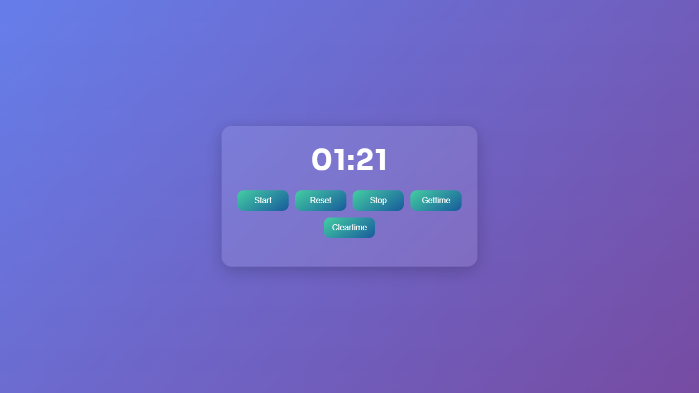

# ⏱️ Modern Stopwatch Web App

A sleek and mobile-responsive stopwatch built with **HTML**, **CSS**, and **JavaScript**, featuring local storage and animations for a smooth user experience. This project helps track time with precision, style, and persistence.

---

&#x20;

---

## 📸 Screenshot


&#x20;

---

## ✨ Features

- ⏳ Start, Stop, Reset timer
- 💾 Saves time state using **Local Storage**
- 🧾 Displays previously saved times
- 🧹 Clear saved times on demand
- 🎨 Modern **UI design** with glassmorphism & gradient backgrounds
- ⚡ Smooth button animations & fade-in effects
- 📱 Fully **responsive** for mobile and tablet devices

---

---

---

## 🛠️ Setup Instructions

1. **Clone this repository**
   ```bash
   git clone https://github.com/C-W-Praduman/stopwatch.git


## 🧠 Tech used

-.**HTML5**
-.**CSS3**
-.**JAVASCRIPT**

---
---

 ## 🐵👨 author

 created with ❤ by Praduman Gupta
---